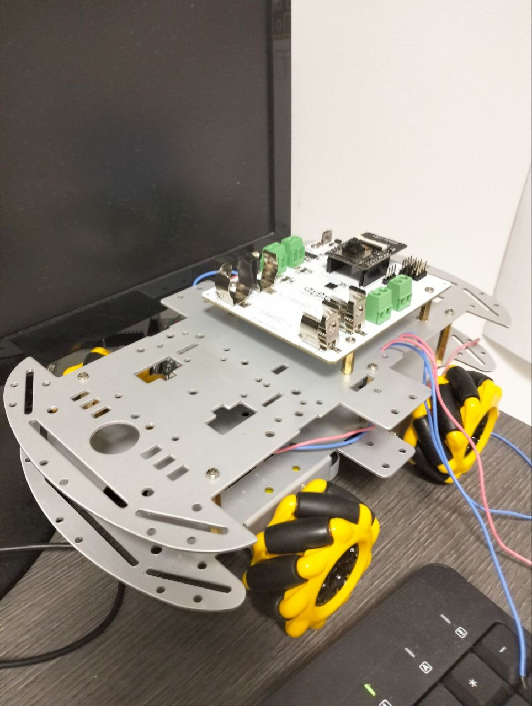

# ESP32 OMNI

How to Bind a Joystick

1. Install this project: [ESP-IDF BLE SPP Client](https://github.com/espressif/esp-idf/blob/master/examples/bluetooth/bluedroid/ble/ble_spp_client)
2. Push the PS button on the joystick.
3. Write down the MAC address of the ESP32.
4. Add this MAC address to the Arduino code.

